# wechat-article-exporter

微信公众号文章导出工具，100%还原文章样式。


## Features

- [x] 搜索公众号
- [x] 搜索公众号内文章
- [x] 导出文章 html (打包了图片和样式文件，能够保证100%还原文章样式)
- [x] 批量导出公众号文章 html
- [x] 缓存文章列表数据，减少接口请求次数 (关键字搜索的文章不会进入缓存)
- [x] 过滤已删除文章
- [ ] 公众号加入收藏列表
- [ ] 支持图片分享消息


## 如何使用？

### 1. 注册一个微信公众号 (已有账号的话跳过)

前往 [微信公众平台](https://mp.weixin.qq.com/cgi-bin/registermidpage?action=index&lang=zh_CN) 注册，服务号和订阅号皆可。

### 2. 二维码扫码登录

进入 [登录页面](https://wechat-article-exporter.deno.dev/login)，用微信扫描页面上的二维码，然后选择自己的公众号进行登录。

### 3. 搜索目标公众号，开始下载文章

通过左上角的公众号切换按钮，搜索自己感兴趣的公众号，如下图所示：

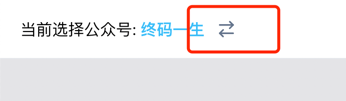

搜索示例：

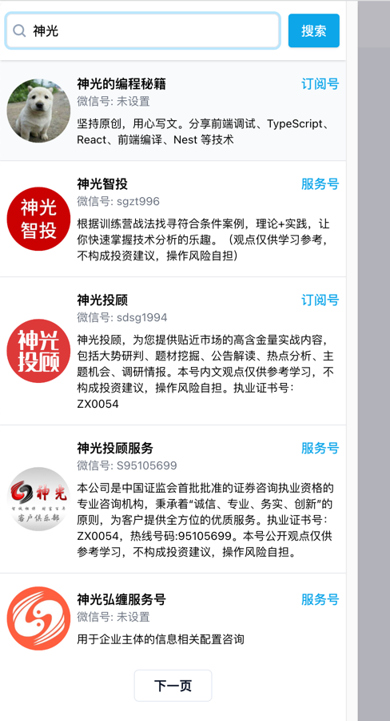


## 关于批量导出

由于微信对相关接口有额度/频率的调用限制，所以批量导出功能并不会去批量获取新的数据，仅仅是将已缓存的数据导出。由于翻页时已经将数据进行了缓存，所以批量导出的数据即页面所显示的数据。

## 代理池

数据的下载采用代理池的思路，以便解决跨域、防盗链、加速等一系列问题。

目前有以下代理节点:
```
https://vproxy-01.deno.dev
https://vproxy-02.deno.dev
https://vproxy-03.deno.dev
https://vproxy-04.deno.dev
https://vproxy-05.deno.dev
https://vproxy-06.deno.dev
https://vproxy-01.jooooock.workers.dev
https://vproxy-02.jooooock.workers.dev
```

> 以上节点都是部署在 Deno Deploy / Cloudflare Workers 上面的免费账户中，算是白嫖了这些托管平台的流量。
> 
> 代理节点越多，则下载速度越快。
> 因此欢迎大家自己搭建一些节点，并进行共享。
> 
> 目前这些节点是公开的，后续打算加入签名验证机制，防止被恶意盗刷。

### Deno Deploy 代理节点代码 (未进行签名验证，请酌情使用)
```ts
function error(msg: Error | string) {
    return new Response(msg instanceof Error ? msg.message : msg, {
        status: 403,
    });
}

async function wfetch(url: string, opt: Record<string, string> = {}) {
    if (!opt) {
        opt = {};
    }
    const options: Record<string, any> = {
        method: "GET",
        headers: {
            "User-Agent":
                "Mozilla/5.0 (Windows NT 10.0; Win64; x64) AppleWebKit/537.36 (KHTML, like Gecko) Chrome/100.0.0.0 Safari/537.36",
        },
    };
    if (opt.referer) {
        options.headers["Referer"] = opt.referer;
    }

    return await fetch(url, options);
}

Deno.serve(async (req: Request) => {
    if (req.method.toLowerCase() !== "get") {
        return error("Method not allowed");
    }

    const origin = req.headers.get("origin")!;
    const { searchParams } = new URL(req.url);
    let url = searchParams.get("url");
    if (!url) {
        return error("url cannot empty");
    }

    url = decodeURIComponent(url);
    console.log("proxy url:", url);

    if (!/^https?:\/\//.test(url)) {
        return error("url not valid");
    }

    const response = await wfetch(url);

    return new Response(response.body, {
        headers: {
            "Access-Control-Allow-Origin": origin,
            "Content-Type": response.headers.get("Content-Type")!,
        },
    });
});
```

### Cloudflare Worker 代理节点代码 (未进行签名验证，请酌情使用)
```js
function error(msg) {
    return new Response(msg instanceof Error ? msg.message : msg, {
        status: 403,
    });
}

async function wfetch(url, opt = {}) {
    if (!opt) {
        opt = {};
    }
    const options = {
        method: "GET",
        headers: {
            "User-Agent":
                "Mozilla/5.0 (Windows NT 10.0; Win64; x64) AppleWebKit/537.36 (KHTML, like Gecko) Chrome/100.0.0.0 Safari/537.36",
        },
    };
    if (opt.referer) {
        options.headers["Referer"] = opt.referer;
    }

    return await fetch(url, options);
}


export default {
  async fetch(req, env, ctx) {
    if (req.method.toLowerCase() !== "get") {
        return error("Method not allowed");
    }

    const origin = req.headers.get("origin");
    const { searchParams } = new URL(req.url);
    let url = searchParams.get("url");
    if (!url) {
        return error("url cannot empty");
    }

    url = decodeURIComponent(url);
    console.log("proxy url:", url);

    if (!/^https?:\/\//.test(url)) {
        return error("url not valid");
    }

    const response = await wfetch(url);

    return new Response(response.body, {
        headers: {
            "Access-Control-Allow-Origin": origin,
            "Content-Type": response.headers.get("Content-Type"),
        },
    });
  },
};
```

## 私有部署

> [!WARNING]
> 由于项目目前还没有进入稳定状态，所以如果进行了私有部署，请随时关注该项目的最新更新，特别是代理部分的变化，后续将会修改使用策略。
> 
> 或者你可以修改`config/index.ts`中的`AVAILABLE_PROXY_LIST`变量，完全使用自己搭建的节点。
> 
> 另外，目前只有部署到 Deno Deploy 的文档，如果需要部署到其他平台，请在 Issue 中说明。

### 部署到 Deno Deploy

#### 1. Fork 该项目

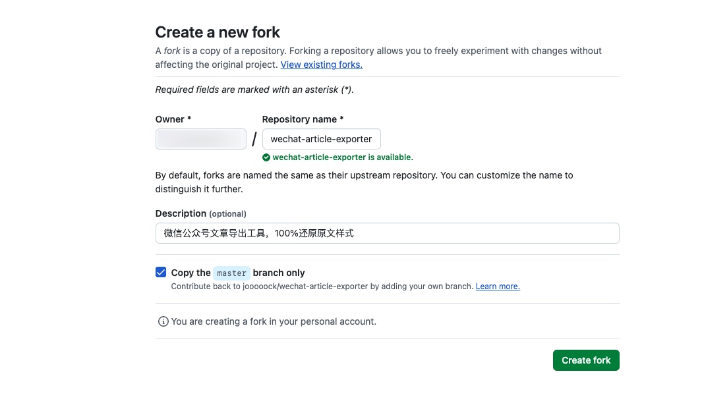

#### 2. 点击 [New Project](https://dash.deno.com/new_project) 在 Deno Deploy 上面创建一个项目，选择你刚fork的仓库，如下图所示:

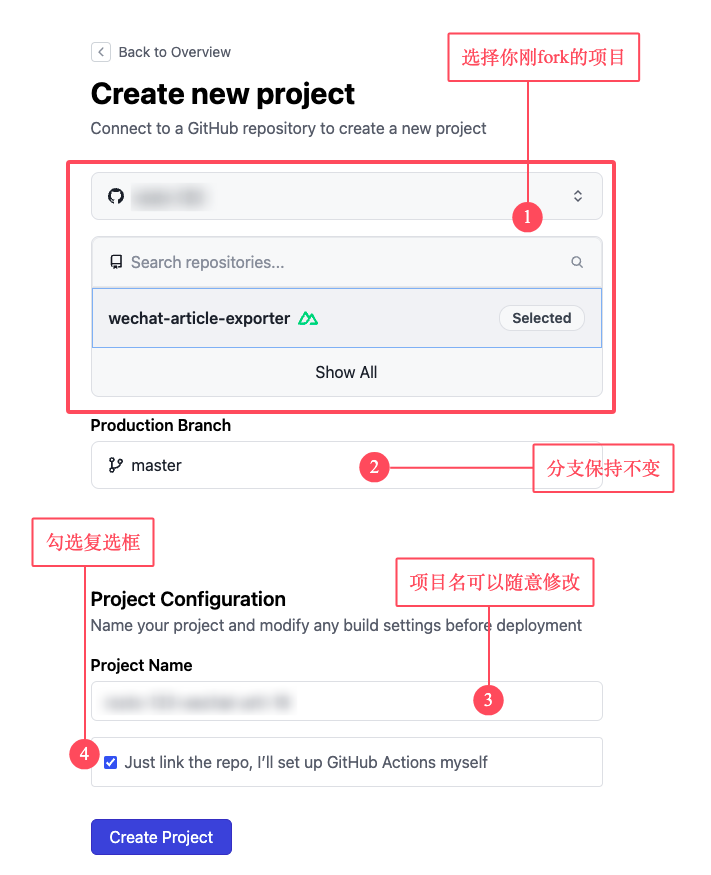

创建之后如下所示:

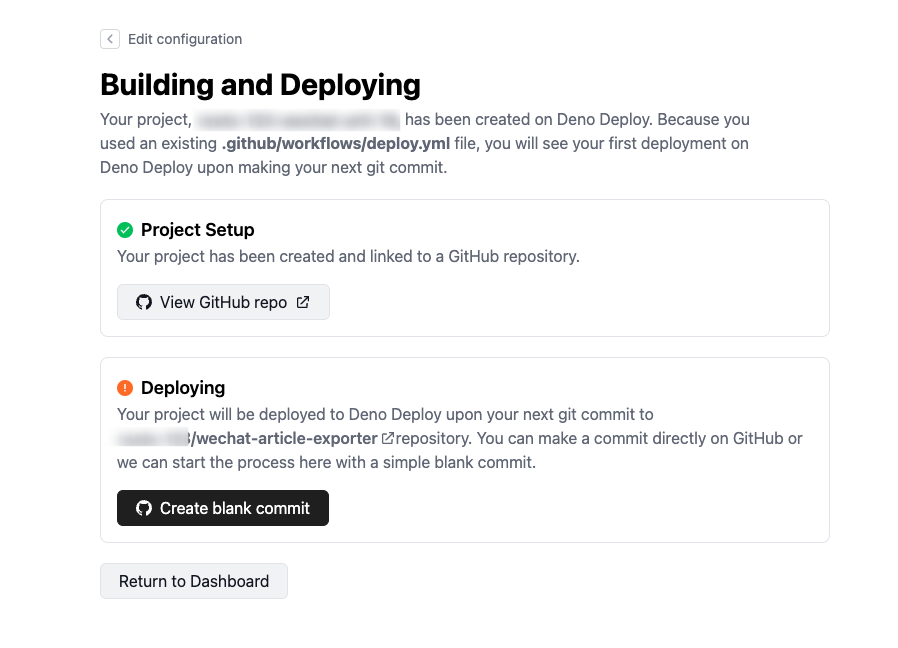

#### 3. 修改github仓库发布配置

启用仓库的 workflows (默认fork的仓库是禁用的):

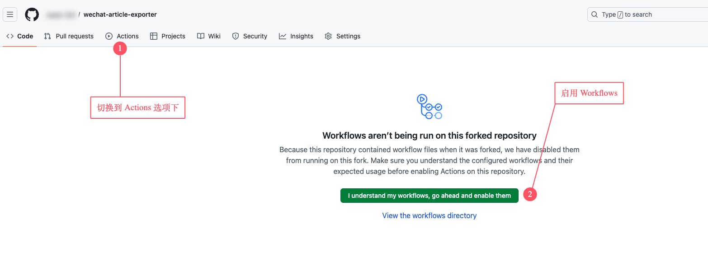

修改`.github/workflows/deno_deploy.yml`:

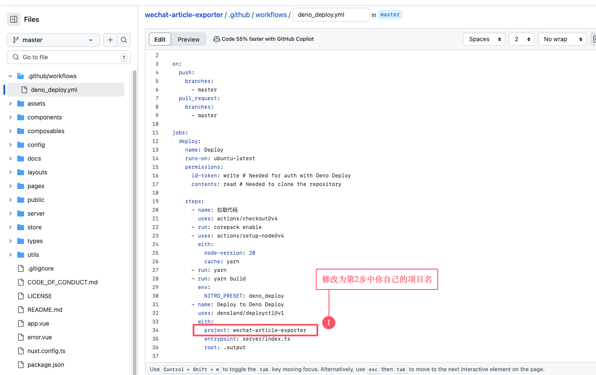

提交:

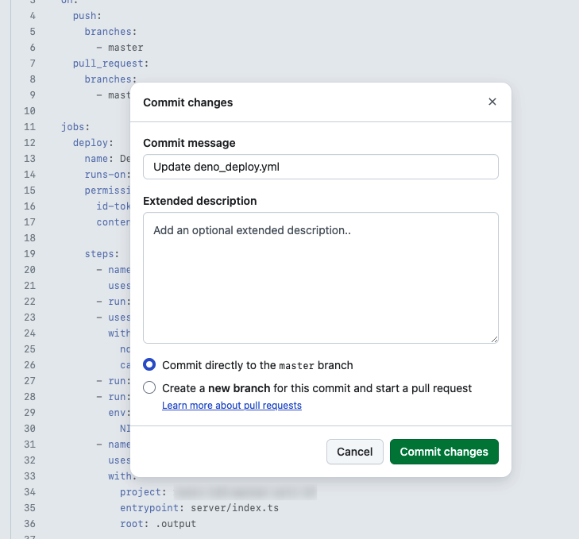

#### 4. 等待发布结果

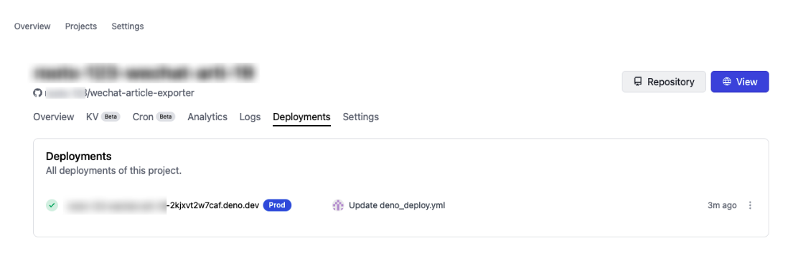

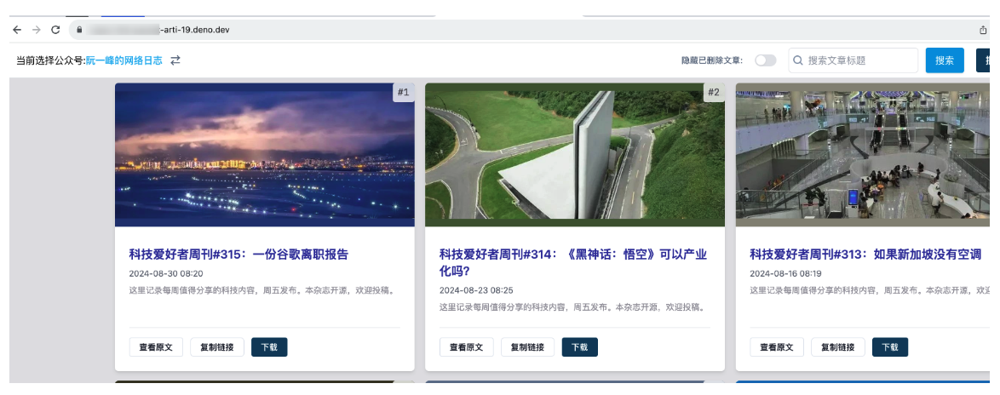

## 原理

在公众号后台写文章时支持搜索其他公众号的文章功能，以此来实现抓取指定公众号所有文章的目的，如下图所示:

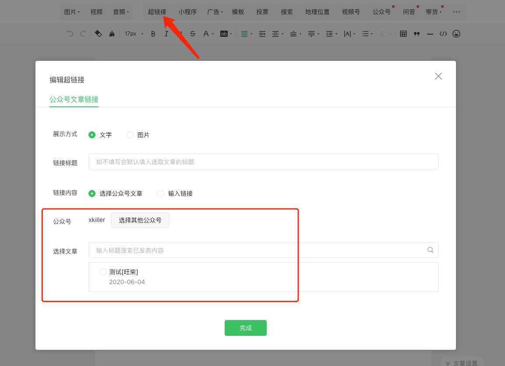


## 感谢

- 感谢 [Deno Deploy](https://deno.com/deploy)、[Cloudflare Workers](https://workers.cloudflare.com) 提供免费托管服务
- 感谢 [WeChat_Article](https://github.com/1061700625/WeChat_Article) 项目提供原理思路


## Star History

[](https://star-history.com/#jooooock/wechat-article-exporter&Timeline)


## License

MIT
