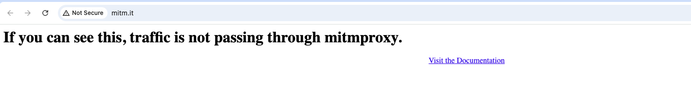
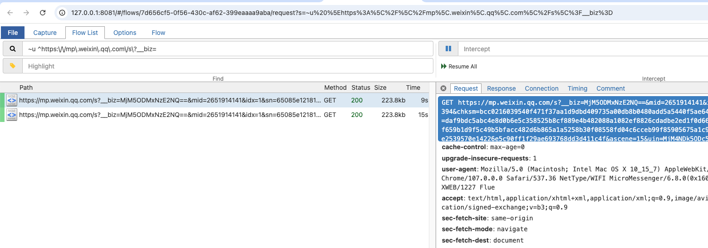
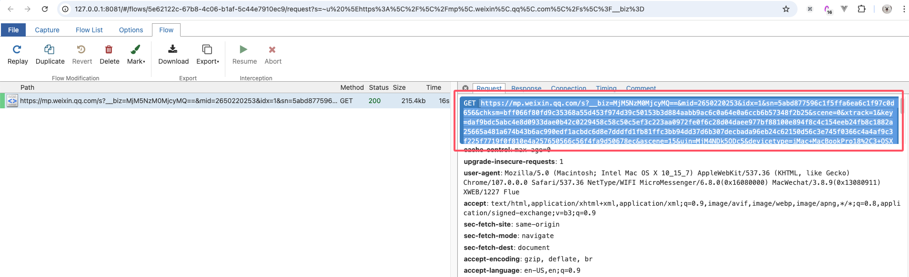
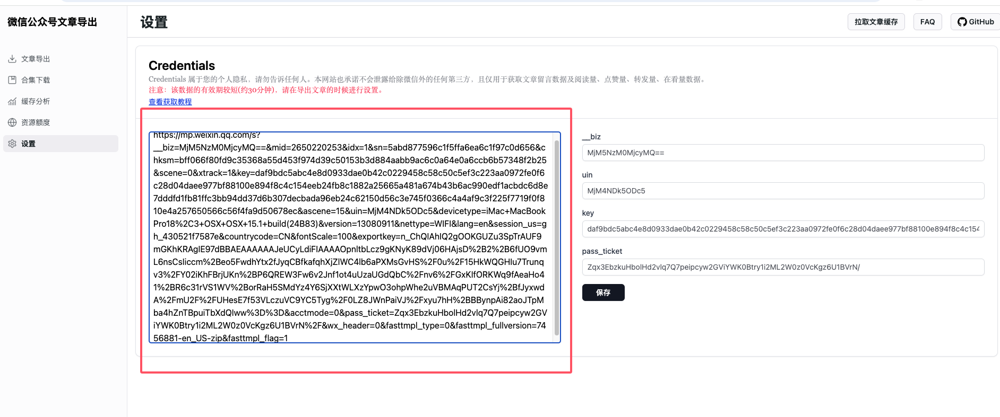

# 如何获取 Credentials 信息

`Credentials`即微信用户的个人凭证，是获取文章的评论和阅读量等数据所必需的。下面说明如何使用 [mitmproxy](https://mitmproxy.org/) 获取该数据：

> 注意，Credentials 的有效期大概为30分钟，推荐在导出文章的时候重新获取。

## 第一步 安装 `mitmproxy`

按照官方的 [安装教程](https://docs.mitmproxy.org/stable/overview-installation/) 在你的系统上安装该工具。

## 第二步 配置 `mitmproxy`

在控制台启动`mitmweb`，如下所示:

可以看到`mitmproxy`的代理服务监听端口为`8080`，将浏览器或系统的代理设置为`127.0.0.1:8080`，然后浏览器访问 http://mitm.it/

如果显示的是下面的界面，则说明系统代理设置有误:

如果系统的代理设置正确，则会出现下面的界面(提示安装证书):

下载对应系统的证书文件并安装进系统中。证书安装之后，`mitmproxy`的配置就完成了。

## 第三步 抓取 Credentials

重启`mitmweb`，然后浏览器打开抓包页面:

搜索过滤器设置为:

`~u ^https:\/\/mp\.weixin\.qq\.com\/s\?__biz=`

用电脑端微信打开目标公众号的任意一篇文章，如下图所示:

然后从`mitmproxy`拦截的请求中找到该请求，复制请求路径并粘贴进系统中:

这样在下载文章的时候就可以同时拉取留言数据和阅读量、转发量、点赞量、在看量数据啦。
