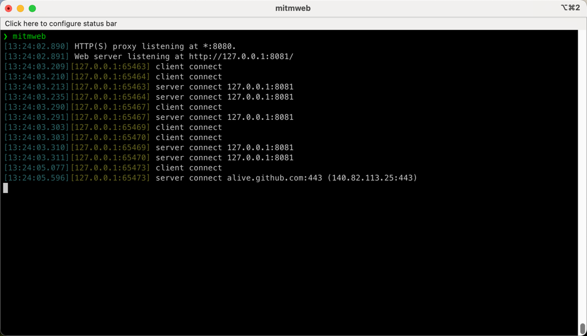
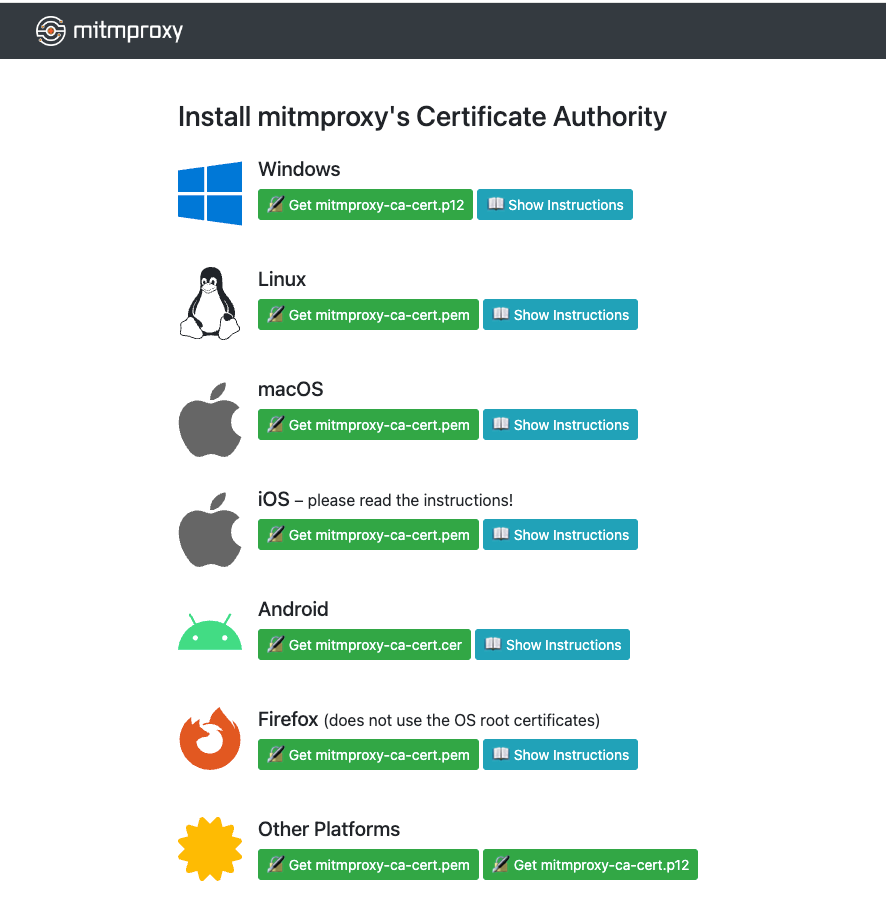
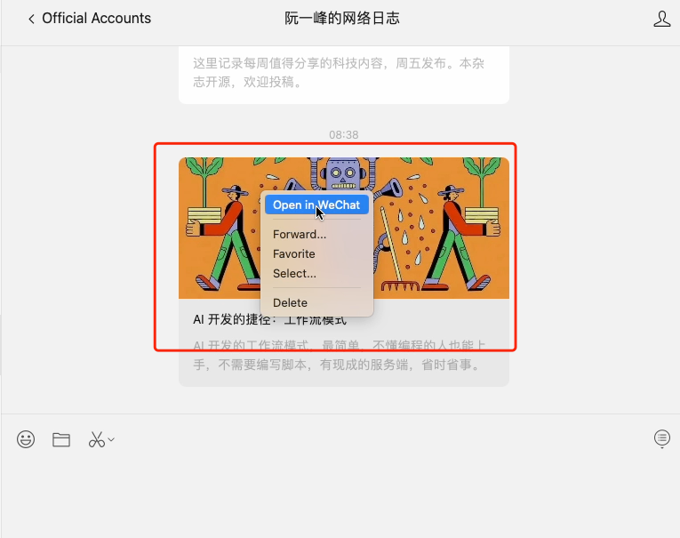
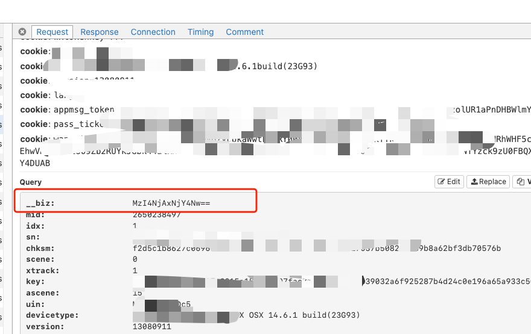
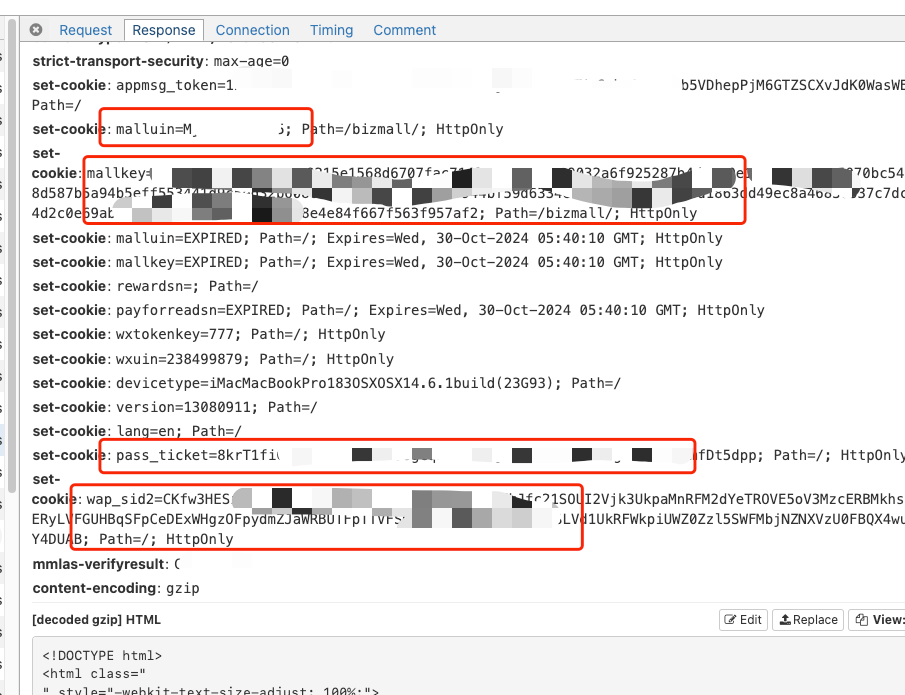

# 如何获取 Credentials 信息

`Credentials`即微信用户的个人凭证，是获取文章的评论和阅读量等数据所必需的。下面说明如何使用 [mitmproxy](https://mitmproxy.org/) 获取该数据：

> 注意，Credentials 的有效期大概为30分钟，推荐在导出文章的时候重新获取。

## 第一步 安装 `mitmproxy`

按照官方的 [安装教程](https://docs.mitmproxy.org/stable/overview-installation/) 在你的系统上安装该工具。

## 第二步 配置 `mitmproxy`

在控制台启动`mitmweb`，如下所示:

可以看到`mitmproxy`的代理地址为`127.0.0.1:8080`，将浏览器或系统的代理设置为该地址，然后浏览器访问 http://mitm.it/ ,按照提示安装证书:

证书安装之后，`mitmproxy`的配置就完成了。

## 第三步 抓取 Credentials

用电脑端微信打开任意一个公众号的文章，如下图所示:

然后从`mitmproxy`拦截的请求中找到该请求，从`Request`中找到`__biz`参数，如下图所示:

从`Response`中找到`uin`、`key`、`pass_ticket`、`wap_sid2`参数，如下图所示:

将对应的值设置进系统中，在下载文章的时候就可以同时拉取评论数据啦。
