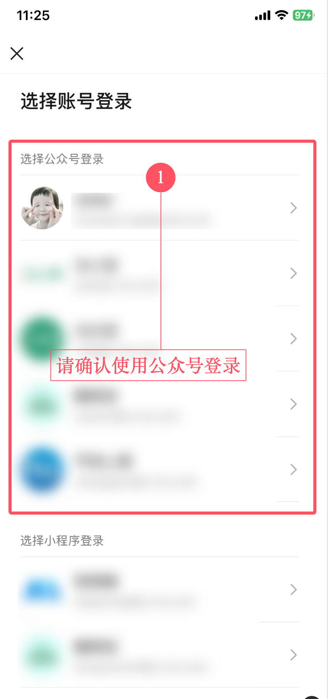
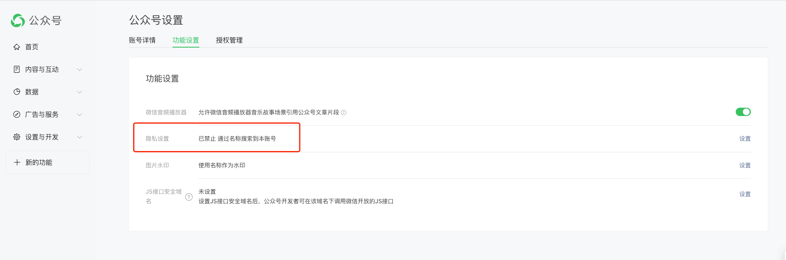

# FAQ

## 搜索公众号时出现`200002:invalid args`

请确认使用的是 **公众号** 扫码登录的，而不是 **小程序**，如下图所示：

## 获取文章列表时出现`200002:invalid args`

由于该项目的原理是基于公众号后台的公众号文章搜索功能，因此目标公众号必须开启 **允许通过名称搜索** 才能获取到文章数据，如下图所示：

## 私有部署时出现二维码不显示的问题

请开启https，因为微信返回的相关cookie中明确使用`secure`属性，所以只有https才能携带该cookie.
